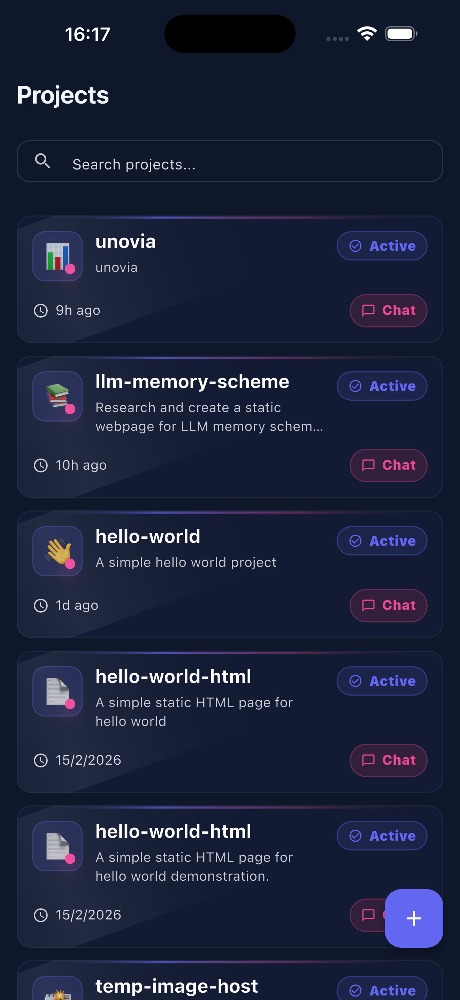
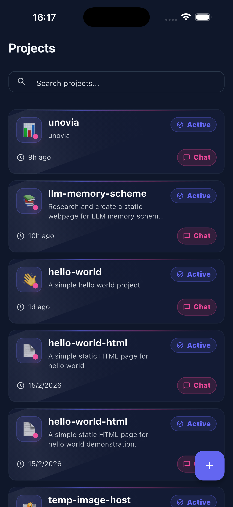
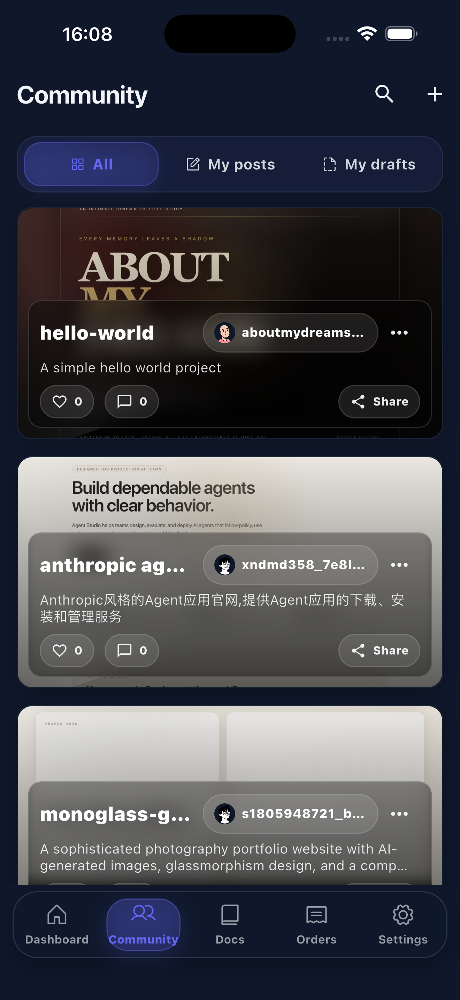
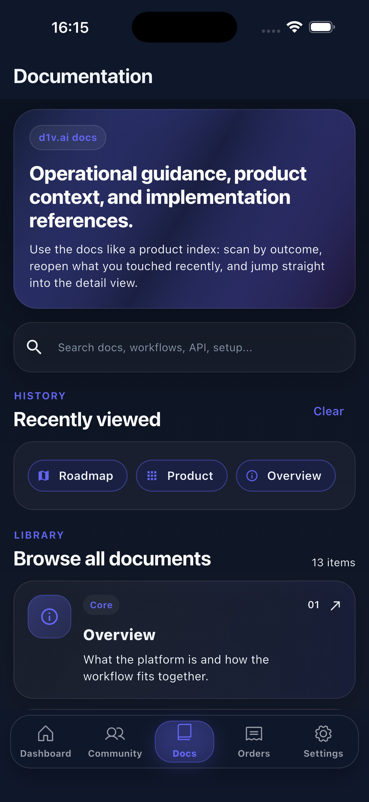

# d1vai_app

  <strong>AI-native mobile workspace for builders, operators, and modern product teams.</strong>

  Official Flutter client for <code>d1v.ai</code>. Create projects, import repositories, chat with AI, inspect files, monitor deployments, and manage operations from your phone.

  <a href="https://www.d1v.ai">Website</a> ·
  <a href="https://github.com/d1vai/d1vai_app/releases">Downloads</a> ·
  <a href="https://www.d1v.ai/docs/overview">Docs</a> ·
  <a href="./docs/DEVELOPER_GUIDE.md">Developer Guide</a> ·
  <a href="./README.zh-CN.md">中文介绍</a>

  
  
  
  
  

  

---

## What It Is

`d1vai_app` is not a notification shell or a thin AI chat wrapper. It is a serious mobile surface for AI-assisted building and operational control.

The app brings the core `d1v.ai` workflow into a mobile-native format:

- create new AI projects
- import GitHub repositories or local archives
- continue project conversations with AI
- inspect code, files, preview state, and deployment context
- manage account, billing, usage, settings, docs, and community surfaces

## Why d1v.ai Mobile Is Different

- Workflow-first, not chat-first
  The product is built around end-to-end project work, not just prompting.
- Operationally useful away from desktop
  You can inspect previews, deployments, analytics, files, and account state from one mobile control plane.
- Connected to real project surfaces
  GitHub import, workspace state, billing flows, and project detail views are part of the app, not bolted-on links.
- Built as a production client
  Authentication, onboarding, diagnostics, theme support, internationalization, and settings are all treated as first-class product areas.

## Product Preview

<table>
  <tr>
    <td align="center" width="33%">
       
      <strong>Projects</strong> 
      Import repositories, manage active work, and jump into project chat.
    </td>
    <td align="center" width="33%">
       
      <strong>Community</strong> 
      Browse published work, share builds, and track creator activity.
    </td>
    <td align="center" width="33%">
       
      <strong>Docs</strong> 
      Search product guidance, workflows, and implementation references in-app.
    </td>
  </tr>
</table>

## What You Can Do

### Build

Start a new project from a prompt, import an existing codebase, or continue work from a mobile chat session without dropping out of the product flow.

### Inspect

Open project files, review structured outputs, read generated code, and keep workspace state visible while you are away from desktop.

### Operate

Track deployment state, preview readiness, analytics, usage, wallet activity, and project health from a single mobile control surface.

### Collaborate

Use AI as part of the working session, not as an isolated chatbot. Project context, model switching, session continuity, and action flows all live inside the same app.

### Manage

Handle authentication, onboarding, invitations, GitHub integration, account settings, docs, and community participation in one place.

## Use Cases

- A founder checks whether a preview deployment is ready while traveling and jumps into the project chat to unblock the next step.
- A product engineer reviews generated code and project files from mobile before handing work back to desktop.
- An operator watches usage, billing, and deployment state without opening multiple internal tools.
- An AI-native team uses the app as a portable control plane for remote workspaces and active projects.

## 3-Minute Tour

1. Sign in and connect your workspace or GitHub integration.
2. Create a project from a prompt or import an existing repository.
3. Open the project chat to continue building with AI.
4. Inspect files, code, preview state, and deployment context.
5. Monitor analytics, usage, billing, and account settings from the same app.

## Why Open Source This App

This repository is useful beyond the product itself.

- It shows how to structure a production Flutter app around AI-native workflows instead of isolated chat screens.
- It demonstrates a mobile control-plane pattern for remote workspaces, project operations, and deployment visibility.
- It provides practical reference material for authentication, onboarding, GitHub import flows, diagnostics, and multi-surface app architecture.

If you are evaluating Flutter architecture, AI product UX, or mobile operational tooling, this codebase is meant to be readable, practical, and extensible.

## Designed For

- Founders shipping from anywhere
- Product engineers who want fast operational visibility on mobile
- AI-native teams building with remote workspaces
- Builders who want a polished mobile control surface instead of raw internal tooling

## Status

- Active codebase with ongoing feature work
- Open-source Flutter client under the MIT License
- Built for iOS and Android
- Internationalized from the start, with multilingual support throughout the app

## Roadmap Direction

Current areas that matter most in this client:

- stronger mobile project workflows and import flows
- deeper AI session continuity and code/file handling
- better deployment, analytics, and operational visibility
- continued UX refinement across billing, settings, docs, and community surfaces

## Quick Links

- [Website](https://www.d1v.ai)
- [Latest Releases](https://github.com/d1vai/d1vai_app/releases)
- [Developer Guide](./docs/DEVELOPER_GUIDE.md)
- [Chinese README](./README.zh-CN.md)
- [License](./LICENSE)
